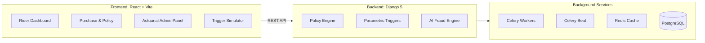

# 🛡️ GigShield — Guidewire DEVTrails 2026

**AI-Powered Parametric Insurance for India’s Gig Economy**


## 🚧 The Problem We're Solving
India’s platform-based delivery partners (Zomato, Swiggy, Zepto, Blinkit, Amazon) are the backbone of the digital economy. However, unpredictable external disruptions—such as **extreme heatwaves, flooding, severe pollution, or unplanned local curfews**—cause immediate interruptions to their work. 

When deliveries are halted, gig workers can lose 20–30% of their weekly earnings. Currently, there is absolutely **zero financial safety net** for temporary, disruption-based loss of income.

## 🚀 The GigShield Solution
GigShield is an AI-enabled **parametric micro-insurance platform** built strictly to safeguard gig workers against **Loss of Income**. 
Our solution utilizes real-time API triggers (weather, environmental, municipal alerts) to continuously monitor the risk environment. When an uncontrollable disruption occurs, GigShield automatically initiates a claim and processes instant payouts so the worker's livelihood is protected without waiting for manual loss adjusters.

---

## ⚖️ The Golden Rules (Strictly Adhered)
1. **Persona Focus:** We have optimized our platform specifically for **Food & Q-Commerce Delivery Partners** (Zomato, Swiggy, BigBasket, Zepto, Blinkit).
2. **Coverage Scope:** Our coverage guarantees **Loss of Income ONLY.** We have heavily coded out strict algorithmic exclusions forbidding claims for health issues, vehicle repairs, or accidents.
3. **Weekly Pricing Model:** Gig workers operate on a week-to-week cashflow basis. All policy premiums, underwriting, and payouts are dynamically calculated using an AI-fueled **Weekly Pricing Matrix**.

---

## 📌 Phase Submissions Roadmap

### 🏁 Phase 1: Ideation & Foundation 
*Theme: "Ideate & Know Your Delivery Worker"*
- **Target Persona Profiling:** Mapped the behavioral workflow of hyper-local delivery riders.
- **Parametric Triggers Defined:** Heatwaves, severe rain, AQI hazards, and localized curfews.
- **Workflow Architecture:** Set up the Web platform designed specifically for mobile-first consumption but managed via a desktop Admin UI.
- **AI Strategy Outline:** Formulated plans for dynamic premium calculation based on risk topologies and an ML-based Isolation Forest algorithm for Fraud Detection.
- **Video Pitch:** *(Insert Phase 1 Video Link Here)*

### ⚙️ Phase 2: Automation & Protection
*Theme: "Protect Your Worker"*
- **Optimized UI Registration:** Fully bespoke dashboard onboarding targeting delivery partners.
- **Dynamic Weekly Premium Calculation:** AI-assisted underwriting that calculates hyper-local zone risk, producing custom ₹/week premium prices.
- **Insurance Policy Management:** Programmatic issuance of legally sound policy documents strictly enforcing loss-of-income limits.
- **Claims Management & Automation:** The `TriggerSimulator` interacts with backend Celery queues to simulate disruption events (e.g., Heavy Rain in Mumbai) and autonomously triggers loss-of-income claims across all active riders in the affected zone.
- **Video Demo:** *(Insert Phase 2 Video Link Here)*

### 🚀 Phase 3: Scale & Optimise
*Theme: "Perfect for Your Worker"*
- **Advanced Hybrid Fraud Detection:** Developed an extensive Scikit-Learn `IsolationForest` ML engine layered with programmatic heuristics (validating IP mismatch, temporal abuse, and excessive historical claims) to automatically route claims into `AUTO-APPROVE` or `MANUAL-REVIEW`.
- **Instant Payout System (Simulated):** Mock integrations processing digital wallet/UPI transactions instantly for automated parametric claims.
- **Intelligent Dashboards:**
  - *Worker View:* Tracks active weekly coverage and wallet payouts.
  - *Admin Underwriting View:* Tracks Loss Ratios, Weekly Expense Ratios, System Exposure, and simulated disruptions (Trigger Simulators).
- **Final Submissions:**
  - **Demo Video:** *(Insert Phase 3 Final Video Link Here)*
  - **Final Pitch Deck:** `GigShield_Pitch_Deck.pdf` uploaded to the root repository.

---

## 🛠️ Architecture & Tech Stack



- **Frontend**: React 19, Vite, Tailwind CSS, Recharts (Actuarial Analytics)
- **Backend**: Django 5.2, Django REST Framework
- **Databases**: PostgreSQL (Main Data), Redis (Message Broker)
- **Background Tasks**: Celery & Celery Beat
- **AI/ML & Data**: Python `scikit-learn`, `numpy`, `pandas`
- **Deployment**: Docker, Gunicorn, Nginx

---

## ⚡ Quick Start: 100% Free Production Deployment

We've specifically structured the repository so you can deploy the 5-engine stack completely for free. 

**Locally (Using Docker):**
```bash
git clone https://github.com/your-repo/gigshield.git
cd gigshield
docker compose -f docker-compose.prod.yml up -d --build
```

**Free Cloud Deployment (Render + Supabase + Upstash):**
A specialized `backend/start.sh` script is included to run Django, Celery, and Celery Beat on a single free instance tier to bypass server costs.
1. Connect DB to Supabase (Postgres).
2. Connect Cache to Upstash (Redis).
3. Connect Frontend to Vercel.
4. Deploy the backend to Render, running `bash start.sh` as the start command.

### 🔑 Demo Credentials

| Role | Username | Password |
|---|---|---|
| Gig Worker | `rider` | `rider123` |
| Admin / Underwriter | `admin` | `admin123` |

---
*Developed for Guidewire DEVTrails 2026*
