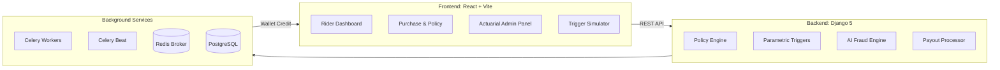

# 🛡️ GigShield

> **AI-Powered Parametric Insurance for India's Gig Economy**
> *Built for Guidewire DEVTrails 2026*


---

## 🎯 Pitch Deck

📊 **[View GigShield Pitch Deck →](https://docs.google.com/presentation/d/1ffPy3qwtQ2d8jUArtEXgG6C0lk3jz8AM/edit?usp=sharing&ouid=106998327190821439217&rtpof=true&sd=true)**

---

## 🎬 Demo Video

📽️ **[Watch the Full Demo →](https://youtu.be/jeTXw669mik?si=cgtjXExHDPbCGYfQ)**

## 🌐 Live Application

🚀 **[Open Live App →](http://98.130.55.67/login)**

| Role | Username | Password |
|------|----------|----------|
| Gig Worker (Rider) | `rider` | `rider123` |
| Admin / Underwriter | `admin` | `admin123` |

---


## 🚧 The Problem

India's 15M+ gig delivery partners have **zero financial safety net** for temporary income disruption caused by uncontrollable external events. When a city-wide heatwave or flood halts deliveries for a day, these workers suffer immediate and uncompensated income loss.

## 🚀 The Solution

GigShield is an **AI-enabled parametric micro-insurance platform** that:
- ✅ Monitors real-time environmental triggers 24/7
- ✅ Automatically files and approves claims with zero paperwork
- ✅ Disburses instant digital payouts within 30 seconds of a trigger
- ✅ Detects and flags fraudulent claims before they are paid
- ✅ Provides actuarial-grade financial monitoring for underwriters

---

## 🛠️ Architecture



---

## 🔨 Built With

React 19, Vite, TypeScript, Tailwind CSS, Recharts, Django 5.2, Django REST Framework, PostgreSQL, Redis, Celery, Celery Beat, scikit-learn, NumPy, pandas, GeoPandas, Docker, Gunicorn, Nginx, OpenWeather API

---

## ⚡ Running Locally

### Prerequisites

- [Docker Desktop](https://www.docker.com/products/docker-desktop/) (v24+) installed and running
- Git

### 1. Clone the Repository

```bash
git clone https://github.com/knarendrakumar187/gigshield.git
cd gigshield
```

### 2. Configure Environment Variables

Copy the example environment file and fill in your values:

```bash
cp backend/.env.example backend/.env
```

Key variables in `backend/.env`:

```env
SECRET_KEY=your-django-secret-key
DEBUG=False
DATABASE_URL=postgresql://gigshield:gigshield@db:5432/gigshield
REDIS_URL=redis://redis:6379/0
OPENWEATHER_API_KEY=your-openweather-api-key   # optional for live triggers
```

### 3. Start the Full Stack (Docker — Recommended)

```bash
# Production-like stack (Django + Celery + Beat + Redis + PostgreSQL + Nginx)
docker compose -f docker-compose.prod.yml up -d --build
```

The app will be available at **http://localhost**.

### 4. Seed Demo Data

```bash
docker compose -f docker-compose.prod.yml exec backend python manage.py migrate
docker compose -f docker-compose.prod.yml exec backend python manage.py seed_demo_data
docker compose -f docker-compose.prod.yml exec backend python seed_demo_payouts.py
```

### 5. Running Without Docker (Dev Mode)

**Backend:**
```bash
cd backend
python -m venv venv && source venv/bin/activate   # Windows: venv\Scripts\activate
pip install -r requirements.txt
python manage.py migrate
python manage.py runserver
```

**Celery Worker (new terminal):**
```bash
celery -A gigshield worker --loglevel=info
```

**Celery Beat (new terminal):**
```bash
celery -A gigshield beat --loglevel=info
```

**Frontend:**
```bash
cd frontend
npm install
npm run dev
```

Frontend dev server: **http://localhost:5173**

---

### 🔑 Demo Credentials

> Try the **[Live App](http://98.130.55.67/login)** directly — no local setup needed.

| Role | Username | Password |
|------|----------|----------|
| Gig Worker (Rider) | `rider` | `rider123` |
| Admin / Underwriter | `admin` | `admin123` |

---

## 📌 Phase Submissions Roadmap

### 🏁 Phase 1 — Ideation & Foundation
*"Ideate & Know Your Delivery Worker"*
- Target persona profiling for hyper-local delivery riders
- Parametric triggers defined: heatwaves, severe rain, AQI hazards, localized curfews
- Mobile-first worker portal + desktop admin UI architecture
- AI strategy: dynamic premium matrix + Isolation Forest fraud detection design
- **Video:** *(Insert Phase 1 Video Link Here)*

### ⚙️ Phase 2 — Automation & Protection
*"Protect Your Worker"*
- Full onboarding flow with KYC and rider profiling
- Dynamic weekly premium calculation with hyper-local zone risk multipliers
- Programmatic policy issuance enforcing loss-of-income-only coverage
- `TriggerSimulator` → Celery fan-out → auto-claim-creation pipeline
- **Video:** *(Insert Phase 2 Video Link Here)*

### 🚀 Phase 3 — Scale & Optimise *(Final)*
*"Perfect for Your Worker"*
- Scikit-learn `IsolationForest` + 5-heuristic hybrid fraud detection
- Thresholds: Auto-Approve (< 0.30), Manual Review (≥ 0.60)
- Instant simulated UPI/wallet payout within 30 seconds of trigger
- Full actuarial dashboard: Loss Ratio, Expense Ratio, Combined Ratio, System Exposure
- **Demo Video:** [Watch →](https://youtu.be/jeTXw669mik?si=cgtjXExHDPbCGYfQ)
- **Live App:** [Open →](http://98.130.55.67/login)
- **Pitch Deck:** [View →](https://docs.google.com/presentation/d/1ffPy3qwtQ2d8jUArtEXgG6C0lk3jz8AM/edit?usp=sharing&ouid=106998327190821439217&rtpof=true&sd=true)

---

## 🔐 The Golden Rules (Strictly Adhered)

1. **Persona Focus**: Optimized exclusively for **Food & Q-Commerce Delivery Partners** (Zomato, Swiggy, BigBasket, Zepto, Blinkit).
2. **Coverage Scope**: Covers **Loss of Income ONLY**. Strict algorithmic exclusions forbid claims for health issues, vehicle repairs, or accidents.
3. **Weekly Pricing Model**: All premiums, underwriting, and payouts are dynamically priced using the AI-driven Weekly Pricing Matrix.

---

*Developed for Guidewire DEVTrails 2026 · Team GigShield*
