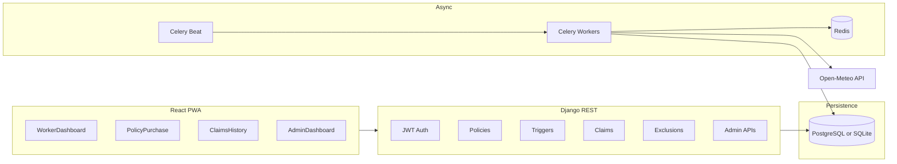

# GigShield Phase 2 — Implementation Plan

## Context

Your workspace is **greenfield**: scaffold the full repo per folder structure (`backend/`, `frontend/`, `scripts/`, `docker-compose.yml`, `README.md`).

**Build sequencing:** `seed_demo` runs **after** premium/actuarial modules exist (policies, claims, triggers in DB) but **before** IsolationForest fitting and **before** serious frontend work. That way fraud ML trains on real historical rows, and dashboards/simulator hit non-empty APIs from day one. Final `setup.ps1` / README document the same order (migrate → seed → train model → run).

## High-level architecture

**Core pipeline (zero-touch claim):** Beat/Celery polls weather → creates `DisruptionTrigger` → for each active `WeeklyPolicy` in zone/date window → `ExclusionEngine.check_claim` → create `Claim` → `run_full_fraud_detection` → auto status → `process_payout` → receipt PDF.

---

## Implementation sections (summary)

1. **Backend foundation** — Django 5 apps, JWT, Celery/Redis, models (`User`, `WorkerProfile`, `WeeklyPolicy`, `DisruptionTrigger`, `Claim`, `Payout`, `FraudLog`, `ExclusionAcknowledgment`, `ActuarialReserve`, `GovernmentAlert`, optional `City` / alerts).
2. **Exclusions** — `STANDARD_EXCLUSIONS_V1`, `ExclusionEngine`, APIs, acknowledgment on purchase.
3. **Premium + actuarial** — `premium_engine`, `financial_model`, `ActuarialReserve`, admin endpoints.
4. **`seed_demo`** — **Early:** after premium/actuarial, **before** fraud ML fit and frontend-heavy work.
5. **Triggers + payouts** — Open-Meteo, `calculate_payout`, Celery tasks, simulate APIs.
6. **Fraud v2** — Rules + IsolationForest **fitted on seeded claims**, `FraudLog`, joblib artifacts.
7. **Frontend** — Vite React 19, **Dark Fintech design system** (see `docs/DESIGN_SYSTEM.md`), pages, Recharts, confetti, bottom nav / admin shell.
8. **Infra** — docker-compose, nginx, `setup.ps1` / `run.ps1`, README.

## Suggested implementation order

1. **Scaffold** — Django models + admin + JWT + migrations.
2. **Exclusions** — Engine + `GovernmentAlert` + APIs + purchase acknowledgment.
3. **Premium + actuarial** — Engines + policy purchase + reserve APIs (+ PDF if grouped here).
4. **`seed_demo`** — Full demo dataset **before** ML training and UI polish.
5. **Triggers + payouts** — Weather, Celery pipeline, simulate/create APIs, REST completion.
6. **Fraud v2** — Fit on seeded data; sub-200ms inference target.
7. **Frontend** — Design tokens, UI kit, pages, Trigger Simulator + live feed, charts.
8. **Infra + docs** — Docker, scripts (migrate → seed → train), README.

## Risk notes

- **EX-06:** Prefer `announcement_at` vs `triggered_at` proxy; document if simplified.
- **Claim timestamp:** Save claim before fraud so `created_at` is meaningful for temporal checks.
- **ORM:** Use `select_related` / `prefetch_related` for zone cluster queries.

_Full Cursor plan metadata and todos may live in `.cursor/plans/`; this file is the project-local copy._
